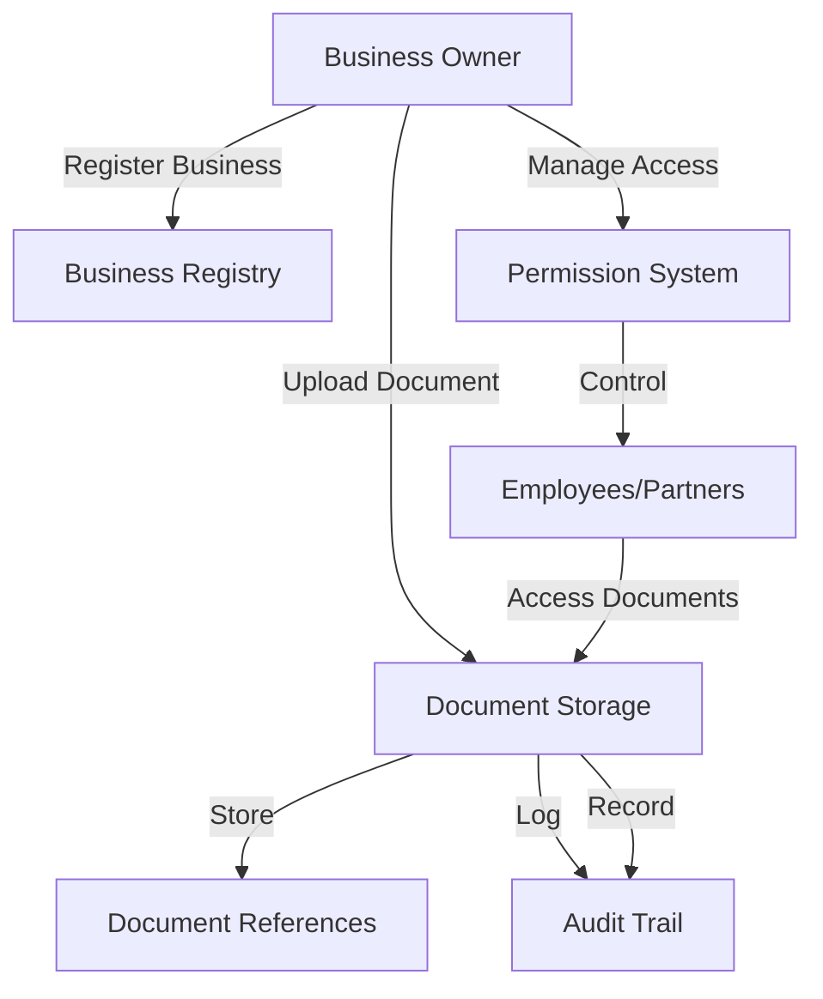

# Collateral Gateway: Enterprise Document Management

A blockchain-powered secure document management system built on the Stacks blockchain, providing enterprises with a robust platform for document storage, access control, and comprehensive audit tracking.

## Overview

Collateral Gateway offers businesses a cutting-edge solution for managing sensitive documents with unparalleled security and transparency. The system provides:

- Enterprise registration on a decentralized ledger
- Secure, reference-based document storage
- Multi-level access control mechanisms
- Immutable, detailed audit logging
- Version-controlled document management

## Architecture

The system is built around a single smart contract that manages business registrations, document references, access permissions, and audit trails.



### Core Components

1. **Business Registry**: Stores business information and ownership
2. **Document Storage**: Manages document metadata and references
3. **Permission System**: Controls access rights
4. **Audit System**: Tracks all document interactions

## Contract Documentation

### Permission Levels

- `PERMISSION-NONE (u0)`: No access
- `PERMISSION-VIEW (u1)`: View-only access
- `PERMISSION-EDIT (u2)`: Can edit documents
- `PERMISSION-ADMIN (u3)`: Can manage permissions
- `PERMISSION-OWNER (u4)`: Full control

### Action Types

- `ACTION-CREATE (u1)`: Document creation
- `ACTION-VIEW (u2)`: Document access
- `ACTION-EDIT (u3)`: Document modification
- `ACTION-SHARE (u4)`: Permission changes
- `ACTION-DELETE (u5)`: Document deletion

## Getting Started

### Prerequisites

- Clarinet
- Stacks wallet
- Node.js environment

### Basic Usage

1. Register a business:
```clarity
(contract-call? .collateral_gateway register-enterprise "enterprise123" "ACME Solutions")
```

2. Add a document:
```clarity
(contract-call? .collateral_gateway add-document 
    "enterprise123" 
    "doc123" 
    "Partnership-Agreement.pdf" 
    "Strategic Partnership Terms" 
    0x1234... 
    "legal")
```

3. Grant access:
```clarity
(contract-call? .collateral_gateway grant-document-access 
    "enterprise123" 
    "doc123" 
    'ST1PQHQKV0RJXZFY1DGX8MNSNYVE3VGZJSRTPGZGM 
    u1)
```

## Function Reference

### Business Management

```clarity
(register-business (business-id (string-ascii 64)) (name (string-ascii 256)))
```
Registers a new business on the platform.

### Document Management

```clarity
(add-document 
    (business-id (string-ascii 64))
    (document-id (string-ascii 64))
    (name (string-ascii 256))
    (description (string-utf8 500))
    (document-hash (buff 32))
    (document-type (string-ascii 64)))
```
Adds a new document to the system.

```clarity
(update-document 
    (business-id (string-ascii 64))
    (document-id (string-ascii 64))
    (name (string-ascii 256))
    (description (string-utf8 500))
    (document-hash (buff 32))
    (document-type (string-ascii 64)))
```
Updates an existing document.

### Access Control

```clarity
(grant-document-permission 
    (business-id (string-ascii 64))
    (document-id (string-ascii 64))
    (user principal)
    (permission-level uint))
```
Grants access permissions to a user.

```clarity
(revoke-document-permission 
    (business-id (string-ascii 64))
    (document-id (string-ascii 64))
    (user principal))
```
Revokes access permissions from a user.

## Development

### Testing

1. Clone the repository
2. Install dependencies
3. Run tests:
```bash
clarinet test
```

### Local Development

1. Start Clarinet console:
```bash
clarinet console
```

2. Deploy contract:
```bash
clarinet deploy
```

## Security Considerations

### Access Control
- Only business owners can register new documents
- Permission levels are strictly enforced
- All access attempts are logged
- Document owners have full control

### Data Privacy
- Only document references are stored on-chain
- Actual documents should be stored off-chain in encrypted form
- Access control is managed through permission levels
- Audit trail maintains accountability

### Limitations
- Document hashes must be managed securely off-chain
- Permission changes require admin access
- No document content encryption on-chain
- Limited to 64-character business and document IDs